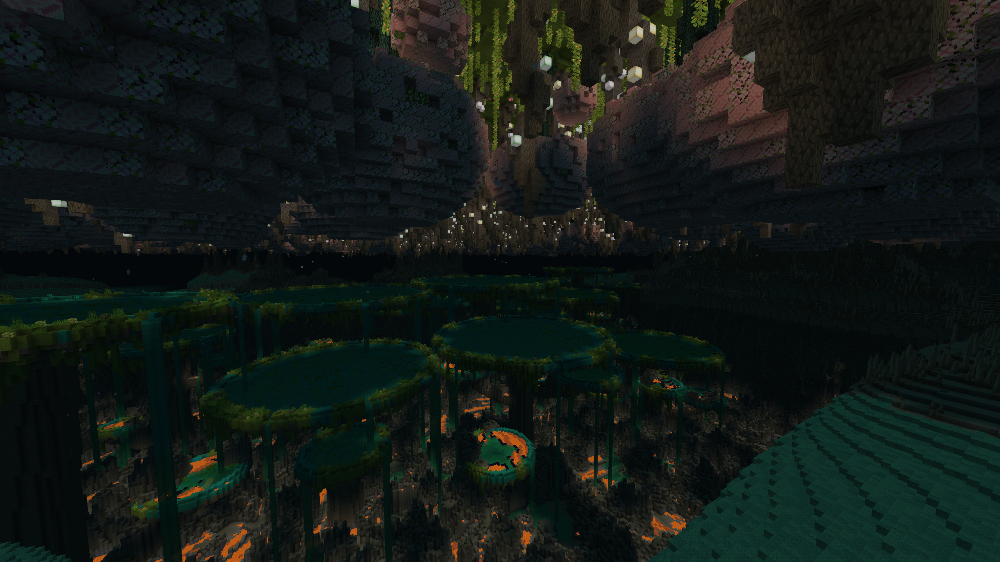

# Rune Ruin

**Rune Ruin** is a WIP NeoForge mod for **Minecraft 26.2.0** (NeoForge `26.2.0.59`).



# World Structure

```
                                          + Y = 512
             /````\                       | 
 TOP LAYER   \_  _/  /````\        .__.   | - - - 217 blocks below build limit
               ||    \_  _/        |  |   |
           ..****...___||         _|__| --|-- ~25 blocks of height - dripstone/deep/dark
        __`             ``''~~''``        |                          caves biomes
       /############################### --+ ↓ Y = 293  ↑ Y = 299 (5 blocks of height)
       || ##`''***~'```''```''***~'```' --|-- ~10 blocks height - blooming caves ceiling
       || ##      BLOOMING CAVES          |                                     biomes
       || ##         LAYER   /````\       | - - - 75 blocks of height
       || ##   /``\          \_  _/       |
       || ##.****./.____       ||  _..* --|-- ~25 blocks of height - blooming caves biomes
~~''``` ``##            ``''~~''``        |
####################################### --+ ↓ Y = 212  ↑ Y = 218
```''~*~''```''***~'```''```''***~'```' --|-- ~10 blocks height - dripstone/deep/dark
        |     *| |       DEEP CAVES   |   |                       caves ceiling biomes
       *\        /         LAYER      /   |
         |*     |*                  *|    | - - - 75 blocks of height
                      /                   |
   /\      ..****..._/ \           _..* --|-- ~25 blocks of height - dripstone/deep/dark
~~''``` ```             ``''~~''``        |                          caves biomes
####################################### --+ ↓ Y = 131  ↑ Y = 137
```''~*~''```''***~'```''```''***~'```' --|-- ~10 blocks height - hot/ice/lost caves
 LOST CAVES    ||           ||            |                       ceiling biomes
   LAYER       ||     *     ||         *  |
        ___    ||     **    ||       ***  | - - - 75 blocks of height
 / / / /0 0\   |**   **     ||**    **    |
 \ \ \ \___/.****.../\__   *|**    /\.* --|-- ~25 blocks of height - hot/ice/lost caves
~~''``` ^^^             ``''~~''``        |                          biomes
####################################### --+ ↓ Y = 50  ↑ Y = 56
```''~*~''```''***~'```''```''***~'```' --|-- ~10 blocks height - void ceiling biomes
                         <>               |
 <>    `         `                <>      | - - - 50 blocks of height
     VOID LAYER          `                + Y = 0
```

## AI Disclosure - 100% Agentic coding with full human review. No AI for assets.

- **NO** AI usage for **textures** with exception for **temporary** ones during development. *No AI assets should be even in beta releases*.
- **NO** AI usage for **assets of any other kind** such as music and models.
- **100%** Agentic coding (**AI writes** + **AI reviews**) with **70%** human review. *Humans review overall architecture and important parts of the code. No guarantee every line was reviewed by humans*.

## TODO

- [ ] **TOP** Layer
  - [ ] Add more biomes. Like a yellow one.
  - [X] Improve generation of the top layer so it isn't too flat.
  - [X] Improve pillars generation and put runes on them.
  - [X] Improve runes design.
- [ ] **Blooming Caves** Layer
  - [ ] Add `Hive` biome as large stone hanging from the top layer and other types of hanging stones
  - [ ] Add `Frog` boss and magic abilities
  - [ ] Add `Pirates Ship` boss/invasion and crew
  - [X] Divide into 2 biomes: jungle and stone forest.
  - [X] Add another type of glowing flora to glow in blooming caves under the top layer (where dark)
- [ ] **Deep Caves** Layer
  - [ ] Add more spike types (mossy, stone etc).
  - [ ] Add more diversity in inverted trees buds
    - [ ] Bird nests
    - [ ] Mini lake?
    - [ ] spider nest?
  - [ ] Add magenta mushrooms biome with big worms.
  - [ ] Add normal mushrooms biome with gnomes.
  - [ ] Add spider caves biome with giant spider boss.
- [ ] **Lost Caves** Layer
  - [ ] Add Ice biome.
  - [ ] Add Giant Goblets extending beyond lost caves layer and with their own ecosystems inside.
  - [X] Add Lava biome.
- [ ] **Void** layer
  - [ ] Add stars as small blocks of stardust - a useful material hard to mine above the abyss.
  - [ ] Add radioactive flesh biome maybe
- [ ] **Equipment**
  - [ ] Add `Blowpipe` - shoots `mossberries` / `glowberries`. applies effect on the enemy
  - [ ] Add `ring` that makes every tool deal x2 damage on poisoned enemies to work with `blowpipe` or a `sword`
  - [ ] Add `Grappling hook`
  - [ ] Add other rock climbing equipment.

## Run

Gradle needs some JDK installed to start; the wrapper then downloads **Java 25** for this project.

```powershell
.\gradlew.bat runClient
```

- `runClient` — launch the game with the mod
- `runServer` — dedicated server (`--nogui`)
- `runGameTestServer` — run GameTests, then exit
- `runData` — datagen into `src/generated/resources`
- `build` — compile and package the mod jar
- `extractMcSources` — explode Minecraft + NeoForge Java into `.mc-sources/` for Agents to index minecraft sources (also runs on IDE Gradle sync)


