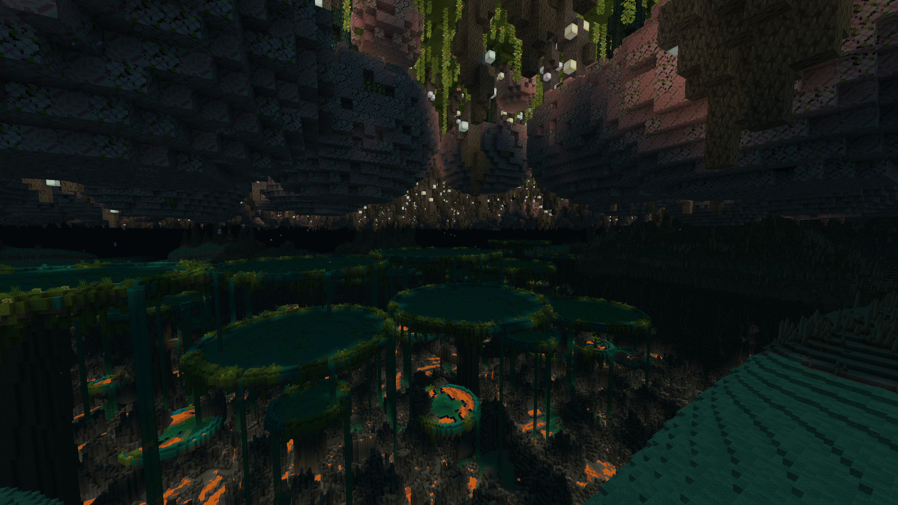

# Rune Ruin

**Rune Ruin** is a WIP NeoForge mod for **Minecraft 26.2.0** (NeoForge `26.2.0.59`).



# World Structure

```
                                          + Y = 512
             /````\                       | 
 TOP LAYER   \_  _/  /````\        .__.   | - - - 217 blocks below the build limit
               ||    \_  _/        |  |   |
           ..****...___||         _|__| --|-- ~25 blocks high - dripstone/deep/dark
       _..`             ``''~~''``        |                          caves biomes
      `|| __                              | Y = 296
       || ##`''***~'```''```''***~'```' --|-- ~10 blocks high - blooming caves ceiling
       || ##      BLOOMING CAVES          |                                     biomes
       || ##         LAYER   /````\       | - - - 75 blocks high
       || ##   /``\          \_  _/       |
       || ##.****./.____       ||  _..* --|-- ~25 blocks high - blooming caves biomes
~~''``` ``##            ``''~~''``        |
                                          | Y = 215
```''~*~''```''***~'```''```''***~'```' --|-- ~10 blocks high - dripstone/deep/dark
        |     *| |       DEEP CAVES   |   |                       caves ceiling biomes
       *\        /         LAYER      /   |
         |*     |*                  *|    | - - - 75 blocks high
                      /                   |
   /\      ..****..._/ \           _..* --|-- ~25 blocks high - dripstone/deep/dark
~~''``` ```             ``''.    |       |                          caves biomes
                            ||    `|      | Y = 134
```''~*~''```''***~'```''```||     ``' --|-- ~10 blocks high - hot/ice/lost caves
 LOST CAVES    ||           ||            |                       ceiling biomes
   LAYER       ||     *     ||         *  |
        ___    ||     **    ||       ***  | - - - 75 blocks high
 / / / /0 0\   |**   **     ||**    **    |
 \ \ \ \___/.****.../\__   *|**    /\.* --|-- ~25 blocks high - hot/ice/lost caves
~~''``` ^^^             ``''~~''``        |                          biomes
                                          | Y = 53
```''~*~''```''***~'```''```''***~'```' --|-- ~10 blocks high - void ceiling biomes
                         <>               |
 <>    `         `                <>      | - - - 50 blocks high
     VOID LAYER          `                + Y = 0
```

## Tasks

Tasks are [issues](https://github.com/IoaNNUwU/runeruin/issues); labels show the stage, a linked pull request shows the work.

- [Bugs to triage](https://github.com/IoaNNUwU/runeruin/issues?q=is%3Aissue+is%3Aopen+label%3A%22needs+triage%22) and [ideas](https://github.com/IoaNNUwU/runeruin/issues?q=is%3Aissue+is%3Aopen+label%3Aidea)
- [Free to take](https://github.com/IoaNNUwU/runeruin/issues?q=is%3Aissue+is%3Aopen+label%3Aconfirmed%2Caccepted+-linked%3Apr): `confirmed` bugs and `accepted` features without a pull request
- [In progress](https://github.com/IoaNNUwU/runeruin/pulls?q=is%3Apr+is%3Aopen+draft%3Atrue) and [waiting for merge](https://github.com/IoaNNUwU/runeruin/pulls?q=is%3Apr+is%3Aopen+draft%3Afalse)
- By layer: [top](https://github.com/IoaNNUwU/runeruin/issues?q=is%3Aissue+is%3Aopen+label%3A%22layer%3A+top%22), [blooming caves](https://github.com/IoaNNUwU/runeruin/issues?q=is%3Aissue+is%3Aopen+label%3A%22layer%3A+blooming+caves%22), [deep caves](https://github.com/IoaNNUwU/runeruin/issues?q=is%3Aissue+is%3Aopen+label%3A%22layer%3A+deep+caves%22), [lost caves](https://github.com/IoaNNUwU/runeruin/issues?q=is%3Aissue+is%3Aopen+label%3A%22layer%3A+lost+caves%22), [void](https://github.com/IoaNNUwU/runeruin/issues?q=is%3Aissue+is%3Aopen+label%3A%22layer%3A+void%22)

Want to help? See [CONTRIBUTING.md](CONTRIBUTING.md).
